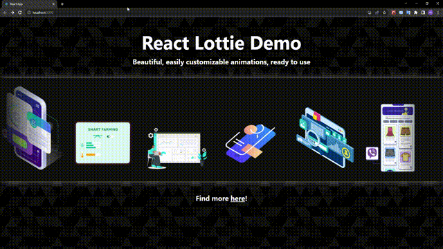

# Lottie Files

A little project that showcases the ease of using Lottie Files to easily use and modify animated SVG assets.

Project made by Mario (with some of my own code modifications).

---

Some screenshots:

---

The tutorial video can be found [here](https://www.youtube.com/watch?v=Y8iTvfclmYM).

